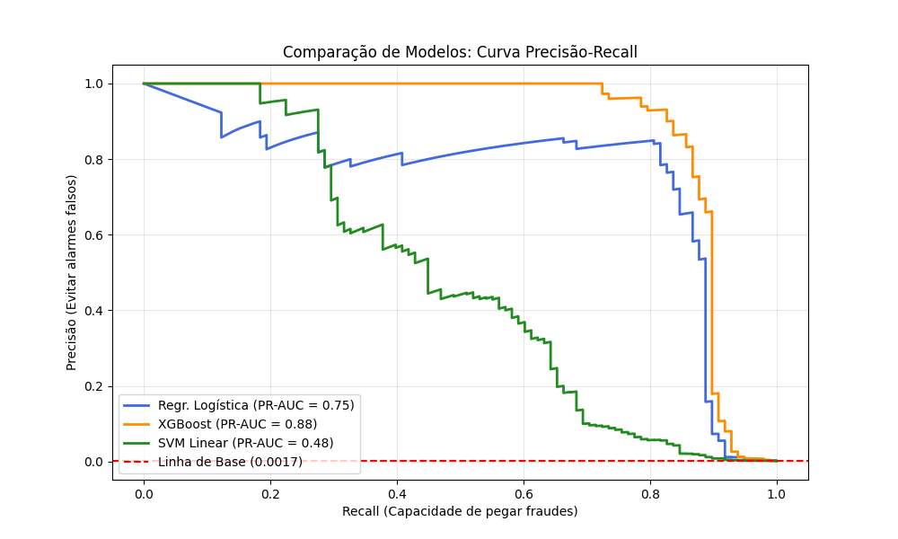
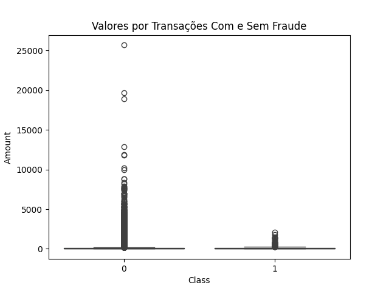
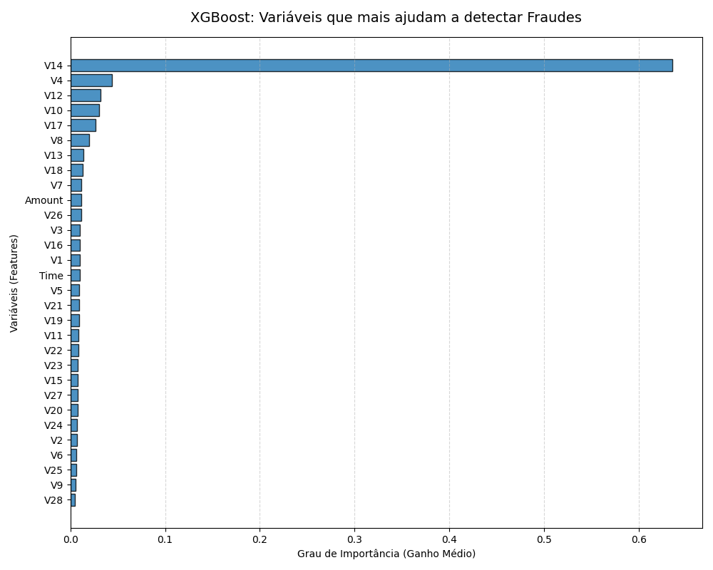

# 💳 Detecção de Fraudes em Cartão de Crédito com Machine Learning

Este projeto foi desenvolvido como **Trabalho de Conclusão** para o **Curso de Ciência de Dados** da **EBAC (Escola Britânica de Artes Criativas e Tecnologia)**. 

Durante o desenvolvimento de algumas das etapas de pré-processamento, otimização de hiperparâmetros, e plotagem da curva Precision x Recall, obtive suporte de tutoria e de ferramentas de inteligência artificial. Soluções eficientes para desafios de processamento computacional (como o travamento do algoritmo SVM) foram encontradas, garantindo que as melhores práticas fossem aplicadas.

* * *

### 🎯 Objetivo do Projeto

O objetivo do projeto é o de encontrar um modelo de machine learning que detecte e propicie o bloqueio de transações de cartão de crédito fraudulentas, garantindo ao mesmo tempo que transações legítimas de clientes não sejam impactadas por alarmes falsos. 

* * *

### 🛠️ Metodologia e Pipeline de Dados

O fluxo do projeto foi estruturado em torno de algumas etapas, dentre as quais destaco:

1.  **Separação Proporcional:** A divisão dos dados em conjuntos de treino e teste foi realizada por meio do parâmetro `stratify`, onde as proporções originais de fraudes foram mantidas em ambas as partições.
   
2.  **Normalização:** As variáveis *Time* e *Amount* foram padronizadas através do `RobustScaler`. Distorções provocadas por valores extremos foram amenizadas com a manutenção da proporção na distância entre os dados.
   
3.  **Superamostragem com SMOTE:** O alto desbalanceamento da base foi corrigido por meio da técnica SMOTE, com a particularidade da configuração de uma taxa limite de amostragem de 20%, pela qual novas fraudes sintéticas foram criadas, o que evitou a duplicação do tamanho da já extensa base original.
   
4.  **Otimização de Hiperparâmetros:** Buscas pelos melhores hiperparâmetros através do `RandomizedSearchCV`, focando na otimização do tempo de processamento como validação cruzada com 3 folds, limitação do número de iterações e método de histogramas (`tree_method='hist'`).

* * *

### 📊 Modelos Testados e Resultados

O desempenho dos algoritmos foi avaliado no conjunto de teste desbalanceado (cenário real). As métricas obtidas são detalhadas a seguir:

*   **XGBoost (Vencedor):** O melhor equilíbrio foi entregue por este modelo, alcançando **0.83 de Precisão** e **0.87 de Recall**.
    
*   **Regressão Logística:** Obteve alta taxa de Recall, 0.89, porém com uma Precisão de 0.20, resultando em excesso de falsos positivos.
    
*   **SVM Linear (SVC):** Baixa taxa de precisão. O processo de otimização foi limitado a um teto de iterações (`max_iter=3000`). Devido à interrupção, o desempenho do modelo foi evidentemente prejudicado.

* * *

### ⚙️ Ajuste do Modelo e Explicabilidade

*   **Threshold Flexível:** O ponto de corte do XGBoost foi elevado para priorizar o cliente legítimo, evitando bloquear transações duvidosas em excesso. Para isso foi estabelecida uma meta de precisão de 90%, o que aumentou o limiar de probabilidades para se detectar fraudes, o que consequentemente causou a redução do Recall, mas mantendo taxa razoável de 84%.
  
*   **Feature Importance:** Verificação da importância de cada variável para avaliar o ganho médio das árvores do XGBoost.

* * *

### Arquivos Gerados para Produção

Após o término do script, para simular um cenário real em que o modelo seria colocado em produção, gerei três arquivos para serem carregados:

*   `modelo_xgb.pkl`: modelo ajustado;
*   `robust_scaler.pkl`: arquivo da normalização;
*   `threshold_calibrado.pkl`: o ponto de corte ideal definido.

* * *

### Visualizações Geradas em Destaque

*Nota: Este projeto foi desenvolvido para fins acadêmicos e de portfólio profissional.*
